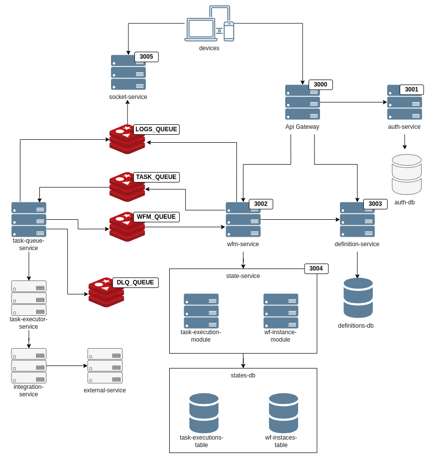
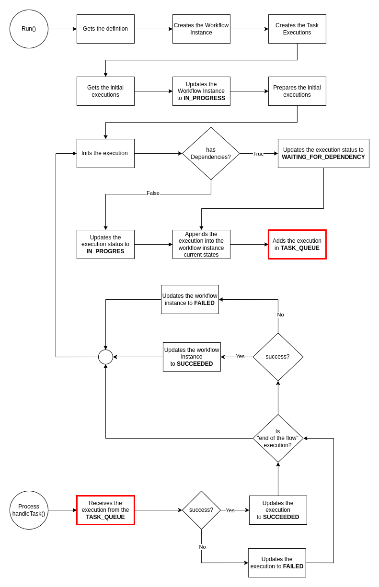

# NestJS Workflow Engine Technical Assessment

## Overview
This application was developed following a microservices and event-driven architecture, focusing on high scalability and modularity.

## Service Diagram


The application consists of a client-facing service called `api-gateway`, which is responsible for receiving all requests and forwarding them via TCP to the microservices `wfm-service`, `socket-service`, and `definition-service`.

The `definition-service` and `state-service` have dedicated PostgreSQL databases.

Services communicate via message queues when necessary. The `socket-service` exposes logs to users with the appropriate permissions.

## Execution Flow



The system follows the workflow outlined above.

## Installation

### 1. Requirements
- Docker and Docker Compose installed.
- Repository cloned locally.

### 2. Running the Application

Start the databases and queues:
```sh
docker-compose -f docker-compose.yaml up -d
```
Then, start each microservice manually:
```sh
cd ./api-gateway  # Example for the api-gateway
npm run start:dev
```
To stop the databases and queues:
```sh
docker-compose -f docker-compose.yaml down --remove-orphans
```

> All environment files (`.env`) are available with properly assigned variables.

## APIs
To test the application endpoints, import the following JSON file into Postman or Insomnia:

[APIs.json](README_FILES/workflow-engine.postman_collection.json)

## Testing, Monitoring, and Improvements

Due to time constraints, only basic tests and monitoring were conducted on the `auth-service`. However, in a real-world environment, implementing comprehensive automated testing, detailed monitoring, and efficient logging across all services is crucial to ensure system stability and reliability.

Additionally, several planned implementations were not completed due to time limitations (e.g., `task-executor-service`, `integration-service`, etc.). Some services were implemented with only the essential functionality to initiate the process (e.g., `definition-service` lacks a complete CRUD and necessary validations). Others do not fully utilize type safety in all cases.

All these points are recognized areas for improvement and should be addressed in future iterations.
