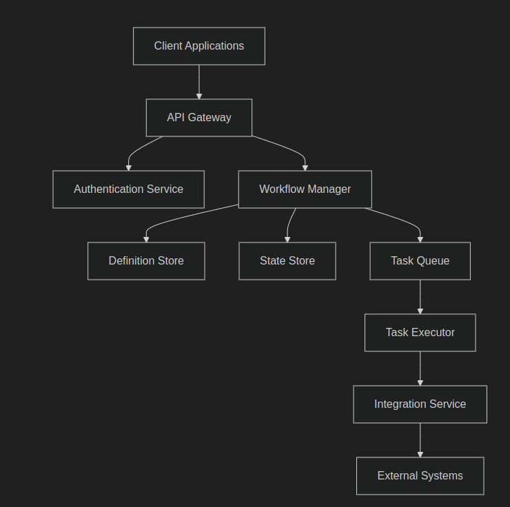

# NestJS Workflow Engine Technical Assessment

## Overview
You are tasked with designing and implementing a scalable workflow engine using
NestJS and Node.js. This assessment evaluates your ability to create enterprise-grade
backend systems with a focus on scalability, security, and maintainability.

### Business Context
The workflow engine will enable organizations to:
- Define and execute custom business processes
- Manage state transitions and process flows
- Track and audit process execution
- Integrate with external systems via APIs
- Handle concurrent workflow executions

### Time Expectations
- Expected completion time: 1 week
- Submission deadline will be provided separately

## Technical Requirements

### Core Features
1. Workflow Definition
- JSON-based workflow definition format
- Support for parallel and sequential tasks
- Conditional branching capabilities
- Task timeout and retry mechanisms

2. State Management
- Persistent workflow state storage
- Transaction management

- State machine implementation
- Recovery mechanisms

3. API Development
- RESTful API endpoints for workflow management
- Real-time status updates via WebSocket
- Comprehensive API documentation
- Rate limiting implementation

4. Security
- JWT-based authentication
- Role-based access control (RBAC)
- API endpoint protection
- Audit logging

### Technical Stack
- Backend Framework: NestJS
- Database: PostgreSQL with TypeORM
- Message Queue: Redis/Bull for task processing
- Caching: Redis
- Testing: Jest
- API Documentation: Swagger/OpenAPI

## Architecture Design

### System Architecture

### Data Model
1. Workflow Definitions
- Workflow metadata
- Task definitions
- Transition rules
- Validation rules

2. Workflow Instances
- Current state
- Execution history
- Variable storage
- Error logs

3. Users and Permissions
- User profiles
- Role definitions
- Access permissions
- Audit records

## Implementation Requirements

### Phase 1: Core Engine
- Workflow definition parser

- State machine implementation
- Basic CRUD operations
- Unit tests

### Phase 2: API Layer
- RESTful endpoints
- Authentication/Authorization
- WebSocket integration
- API documentation

### Phase 3: Task Processing
- Task queue implementation
- Retry mechanisms
- Error handling
- Performance optimization

### Phase 4: Monitoring &amp; Logging
- Audit logging
- Performance metrics
- Health checks
- Error reporting

## Deliverables

1. Source Code
- Complete NestJS application
- Migration scripts
- Test suite
- Docker configuration
- Upload and share a github with the instructions.

2. Documentation
- System architecture document
- API specifications
- Data model documentation
- Deployment guide

3. Technical Analysis
- Performance considerations
- Scalability approach
- Security measures
- Maintenance guidelines

## Submission Guidelines
1. Create a private GitHub repository
2. Include comprehensive README.md
3. Provide setup instructions
4. Document all assumptions
5. Include testing instructions

## Evaluation Process

1. Code Review
- Architecture review
- Code quality assessment
- Testing evaluation
- Documentation review

2. Technical Discussion
- Architecture decisions
- Technical choices
- Scalability approach

- Security considerations

3. Final Assessment
- Requirements completion
- Code quality
- Documentation quality
- Overall approach